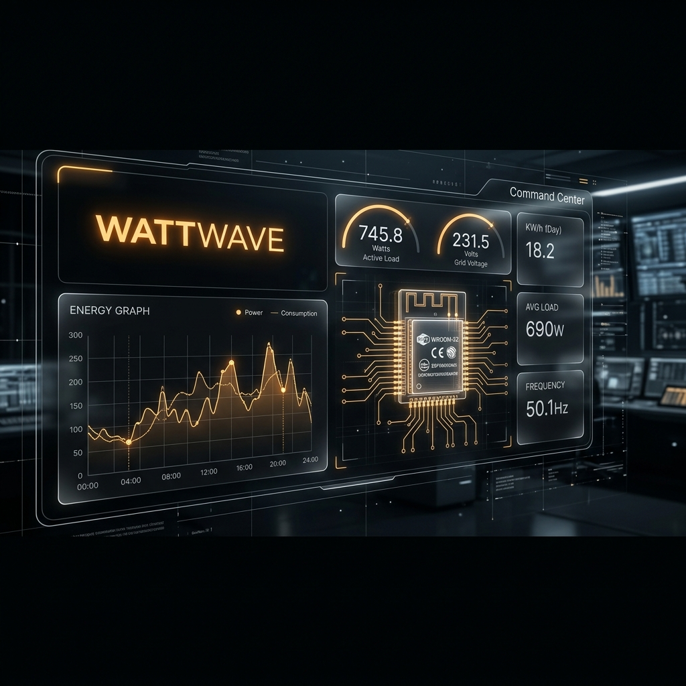
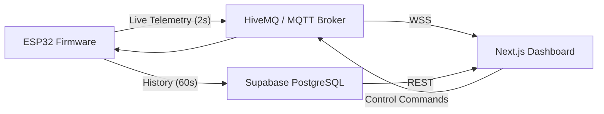

# ⚡ WattWave: High-Performance IoT Energy Ecosystem



WattWave is a complete, open-source **IoT + WebDev package** for real-time energy monitoring and home automation. It bridges the gap between hardware sensors and a premium cloud-synced "Command Center" dashboard.

> [!CAUTION]
> **SAFETY FIRST**: This project involves high-voltage AC electrical components. Always disconnect mains power before handling circuitry. Use appropriate isolation (ZMPT101B) and never work alone.

---

## 🏗️ The Architecture

WattWave uses a "No-Backend" architecture for maximum speed and simplicity.



- **Live Data**: 2-second updates via MQTT over secure WebSockets.
- **Historical Insights**: Persistent storage via Supabase for daily/weekly trends.
- **Remote Control**: Latency-free relay toggling for connected appliances.
- **OTA Updates**: Update your firmware over-the-air via the built-in web server.

---

## 🤖 AI-Assisted Development

WattWave is optimized for **AI-First Development**. If you are using an AI coding agent (Claude Code, Cursor, Windsurf, etc.), you can simply tell it to:

> *"Read the `AGENTS.md` file in the root directory and help me set up/customize this project."*

The `AGENTS.md` file contains the repository's core mental model, security protocols, and architectural rules, allowing the agent to provide precision guidance, perform security-hardened refactors, and assist with complex hardware integrations.

---

## 🛡️ Security
WattWave features a lightweight authentication model and server-side credential vaulting designed for secure personal deployments. This setup provides essential privacy for private interfaces and can be easily upgraded with more robust authentication providers (e.g., Supabase Auth) depending on your deployment environment.

---

## 🛠️ Requirements

### Hardware
- **Core**: ESP32 DevKit V1 (WROOM-32)
- **Monitoring**: ACS712-5A (Current), ZMPT101B (Voltage)
- **Control**: 3-Channel Relay Module (High/Low trigger supported)
- **Power**: 5V DC for ESP32/Relays + AC Mains for monitoring

> [!NOTE]
> **Performance Note**: The included ACS712 sensors are excellent for medium-to-high loads but can be noisy at very low currents (<10W). This project includes **software noise-gates** (filtered at the firmware level) to stabilize readings. For industrial-grade precision, see the [Upgrade Path](#-scaling--upgrades) below.

---

## 🚀 Scaling & Upgrades

WattWave is designed to be highly extensible. You can easily upgrade the hardware with minimal software tweaks:

### 1. Higher Precision Sensors
For more accurate low-current monitoring, swap the ACS712 for:
- **SCT-013-000**: Non-invasive clamp sensor (requires a simple DC-bias circuit).
- **PZEM-004T**: A dedicated UART-based energy module that offloads all RMS calculations from the ESP32.
- **Tweak**: Simply update the `readVoltage()` and `readCurrent()` functions in `firmware/wattwave.ino` to use the respective libraries (e.g., `EmonLib`).

### 2. More Control Channels
To control more than 3 appliances:
- **Hardware**: Use an **MCP23017 (I2C I/O Expander)** to add up to 16 more relay channels using only 2 pins (SDA/SCL).
- **Tweak**: Add new `TOPIC_PLUG_X_CONTROL` constants in the firmware and update the dashboard's `PlugCard` grid to display the new units.

### Software
- **Arduino IDE 2.x** with ESP32 Board Support
- **Next.js 14+** (React)
- **Supabase Account** (Free tier works great)
- **MQTT Broker** (HiveMQ Cloud or EMQX recommended)

---

## 🚀 Setup Guide

### Phase 1: Cloud Infrastructure
1. **Supabase**:
   - Create a project at [supabase.com](https://supabase.com).
   - Go to **SQL Editor** -> **New Query**.
   - Copy the contents of `supabase/setup.sql` and run it. This sets up your tables and security.
   - Note your `URL` and `Anon Key` from **Project Settings > API**.
2. **MQTT**:
   - Create a free cluster at [HiveMQ Cloud](https://www.hivemq.com/mqtt-cloud-broker/).
   - Add a credential (Username/Password).
   - Note your `Host` URL (e.g., `xxxx.s1.eu.hivemq.cloud`).

### Phase 2: Hardware & Firmware
The WattWave firmware is the brain of the system, featuring **True RMS energy math**, dual-path cloud syncing, and a secure MQTT command interface.

1. **Configure**: 
   - Copy `firmware/config.h.example` to `firmware/config.h`.
   - Enter your WiFi, MQTT, and Supabase credentials.
2. **Setup**: For detailed technical specs, pinouts, and calibration guides, see the [Firmware Documentation](firmware/README.md).
3. **Libraries**: Install via Arduino Library Manager:
   - `PubSubClient`, `ArduinoJson`, `WiFiManager`.
4. **Flash**: Connect ESP32 and hit **Upload** in Arduino IDE.
5. **Wiring**: Follow the pin mapping defined in the [Firmware README](firmware/README.md).

### Phase 3: Dashboard Setup
1. **Install**:
   ```bash
   cd dashboard
   pnpm install
   ```
2. **Configure**:
   - Copy `.env.example` to `.env.local`.
   - Enter your credentials (same as Phase 1).
3. **Run**:
   ```bash
   pnpm dev
   ```
   Visit `localhost:3000` and use your `DASHBOARD_PASSWORD` to log in.

### Phase 4: Production Deployment
1. **Vercel**:
   - Push your code to GitHub.
   - Import the repository into Vercel.
   - Set the **Root Directory** to `dashboard`.
   - Add all environment variables from `.env.local` to Vercel.
   - Deploy!

---

## 🎨 Premium Aesthetics
WattWave features a **Command Center UI** inspired by top-tier Dribbble designs:
- **Thin-Line Neon Charts**: Elegant visualizations using Recharts.
- **Glassmorphic Components**: Semi-transparent panels with subtle blur.
- **Pill Toggles**: Modern tactile controls for your smart outlets.
- **Real-time Status HUD**: Live health metrics (RSSI, Uptime, Memory) at a glance.

---

## ⚙️ Advanced Tuning

For power users, several low-level parameters can be tuned in the codebase:

- **MQTT Latency**: Adjust `TELEMETRY_BUFFER_DURATION_MS` in `dashboard/hooks/useMqttDevice.ts` to balance real-time responsiveness vs. browser performance.
- **Offline Detection**: Modify `OFFLINE_THRESHOLD_MS` in the same file to change how quickly a device is marked as "Offline" after losing signal.
- **Firmware Noise-Gate**: Change `currentNoiseThreshold` in `firmware/main.cpp` if your ACS712 sensor is particularly noisy or sensitive.

---

## 🛡️ License
Distributed under the **MIT License**. See `LICENSE` for more information.

---

### 👨‍💻 Contributing
Contributions are welcome! Please open an issue or submit a pull request for any improvements or new sensor integrations.
